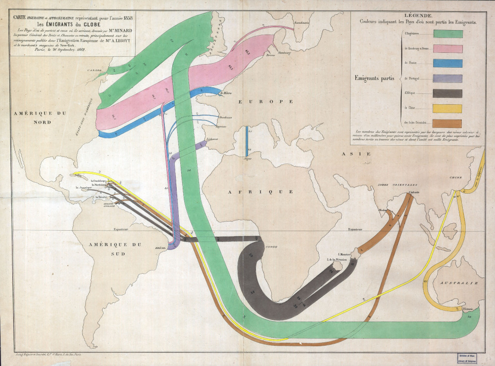

Assignment 1
================
Sushmita V Gopalan
4/3/2018

Part 1: Visualization Critique
------------------------------



This is another of the French engineer Charles Minard's famous visualizations. He created this map in 1858, depicting flows of humans across the world in that year. He pioneered 'flow' lines on maps - with thickness being proportional to the volume of 'things' moving.This is said to have been inspired by his work as a civil engineer, working with bridges and canals - i.e., *flowing* water.

### Is it truthful?

It is hard to assess the veracity of a visualization without access to the raw data used to create it. However, the flows generally appear to be consistent with what we know of modern history - with North America and Australia being the primary destinations for emmigrants. The UK appears to be the largest source of emigration to the USA and Australia. David Kaplan, a Geography professor from Kent University however, points out two issues. He thinks the map underestimates outflow from China and India because official data sources were not updated in a timely manner. He also attributes the fact that France has a thinner outflow than its neighbours to Minard's 'national self-satisifaction' and not just limitations of available data.

### Is it functional?

I think the map is definitely functional. It purports to illustrate the flows of migrants across the world. By using colour and width respectively, to indicate the nationalities and volumes of migrants, Minard adds dimension to the data depicted. While the legend makes it clear that the colours indicate the countries migrants *leave* from - adding arrows to highlight the direction of movement would have helped.

It's interesting that tiny countries like France, England and Portugal get their own lines and colours while the huge African continent is represented as one single country. The fact that white, western countries are represented with richer, more disaggregated data suggests their centrality to the analyst and points to the fact that large regions like South Asia and Africa were treated (fallaciously) as homogenous. Also, while being both *literally* and figuratively Eurocentric, the map makes Europe appear disproportionately large while the African and Australian continents seem to be distorted in shape.

### Is it beautiful?

This is a gorgeous map with tastefully chosen colours enhanced by the vintage vibe (it's *actually* old, though) of the parchment it is drawn on. The French calligraphy is beautifully rendered too. However, I can't help but notice that the white, western countries get a 'neutral' pastel shade each, but Africa, China and India are coded in black, yellow and brown, respectively, potentially representing how Minard saw the skin colours of these regions. This is very likely to point at a culture of racism, internalized or otherwise.

### Is it insightful?

The purpose of this visualization is essentially description. While it does a very good job of that, it neither intends nor claims to produce any startling revalations. The differently coloured thick and thin lines snaking across a map of the world are a great way to visualize movement - it is also evocative of flowing water and hence further connotes movement and transportation. One can see immediately that most migration flows out of the UK to the US and Australia. Most movement either takes place between places that are considered the 'first world' or from the 'third world' to the 'first world'.

### Is it enlightening?

I think the design choices made in the visualization actually shed light on several realities of the time it depicts. An important distinction between the emmigrants from Europe and those from India/ Africa has not been made - bulk of the migrants from India and Africa were labourers forcibly 'transported' across the ocean, while most European migrants moved of their own accord, in search of greener pastures and colonies to subjugate. The different levels of data aggregation, choice of colour are also reflective of the political circumstances in which the map was drawn.

Part 2: Create a Static Visualization
-------------------------------------

``` r
df <- read.csv("plot_data.csv")
df <- df %>% filter(ethnicity == 991 | ethnicity == 992 | ethnicity == 993)
df1 <- df %>% filter(u5 == 1)
counts1 <- with(df1,table(ethnicity,wi))
counts <- with(df, table(ethnicity,wi))

# get proportions
prop <- counts1/counts # this does element wise division
# get infant mortality rate
imr <- prop*1000
```

``` r
ggplot(data = as.data.frame(imr) , aes(x = ethnicity, y = Freq)) +
  geom_col(aes(fill=ethnicity)) +
  facet_wrap(~ wi, nrow = 1, strip.position = "bottom") + 

  labs(title = "Infant Mortality Rate in India across Wealth Index and Caste (2015-16)",
       subtitle = "Infant Mortality Rate: Number of Deaths under 1 year of age per 1,000 live births",
       x = "Wealth Index (1 = Very Poor, 5 = Very Rich)",
       y = "Infant Mortality Rate")+
  
  scale_x_discrete(limits = c("993","992","991"))+
  scale_fill_manual(name = "Caste", 
                    values = c("991" = "dark blue", "992" = "darkgoldenrod3", "993" = "dark red"), 
                    labels = c("SC: Scheduled Caste", "ST: Scheduled Tribe", "OC: Other Castes"))  +
  theme_minimal() +
  theme(axis.text.x=element_blank(),
        panel.grid.major = element_blank())
```


The purpose of this graph is to illustrate that the negative impact of belonging to a marginalized caste on the risk of infant death persists across all levels of wealth. This is part of my analysis for my M.A. thesis where I'm exploring the determinants of infant mortality in India. Infant Mortality Rate (IMR) is defined as the number of deaths within the age of 1 per 1,000 live births. The data is from the Demographic Health Survey (DHS) conducted in 2015-16. It is a nationally representative survey conducted by the Ministry of Health and Family Welfare, Government of India. The data is hosted by the USAID and can only be obtained via an application - hence, I am unable to upload the data I use to create my plot on Github. I did not have to specifically clean or transform my data for this assignment as I had already cleaned all my data for analysis on my thesis.

The Government of India maintains two lists of social groups - Scheduled Castes and Scheduled Tribes, that have been identified as historically oppressed and marginalized, in order to better address their needs. The graph above plots three different variables - an infant's family's wealth (quintile) index, a measure created in the DHS surveys, their family's caste identity and a binary variable indicating whether or not the infant survived past the age of one. We see first that infants born to more wealthy families are at higher risk of infant death. We also that within each wealth level, children of scheduled caste families are at highest risk, followed by children of scheduled tribes. Children who belong to the other, socially dominant caste groups are at lower risk. This pattern holds across all five wealth levels.

The height of each bar is proportional to the cateogry's IMR. The colour of each bar represents a caste category. I chose to use `facet_wrap` to split my data into subsets by wealth index and then plot IMR vs caste within each subset. Typically, `facet_wrap` displays a square grid of plots - but I used the `nrow = 1` option in the `facet_wrap` command to have them all appear in a single row. This can also be achieved by using `ncol = len(unique(df$wi))`. I changed the position of the labels indicated each group's wealth index to the bottom in order to make it apparent that the numbers corresponded to my x-axis label. I used the `limits` option in the `scale_x_descrete` function to re-order the caste bars in increasing order of IMR.

I debated between 'facet'-ing by caste instead and having bars for wealth index, but I chose not to go in that direction, because the message I want to convey is 'caste negatively impacts IMR across wealth levels' and not 'poverty negatively impacts IMR across all castes' because the former is the less obvious pattern.

The colours I chose are colour-blind friendly and sober. While they could be more pretty, it feels inappropriate to have gorgeous hues illuminating patterns in infant death. I think my title, subtitle, legend and axis labels together present a self-contained picture. I figured adding the direction of the wealth index scale to the x-axis label would help make the graph more self-explanatory. All information required to interpret the graph is available in its body.
